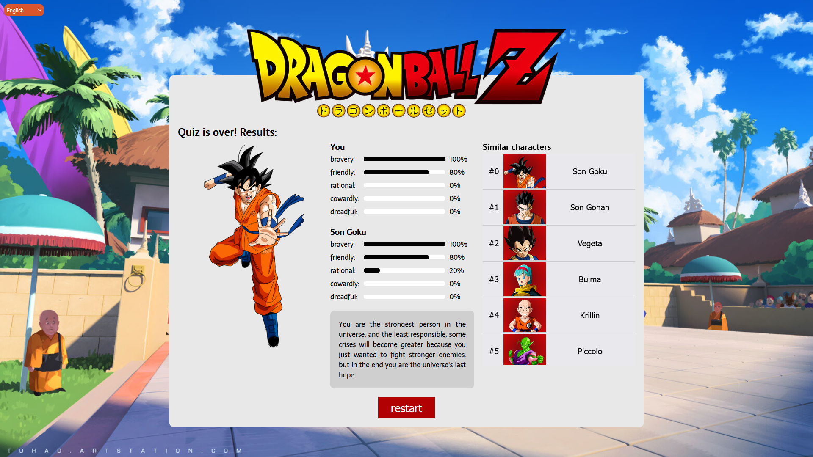

# Dragon Ball Z Quiz

## Outros Idiomas:

* English

Versão no ar: [https://dsleite.com.br/projects/quiz](https://dsleite.com.br/projects/quiz)

Dragon ball Z Quiz é um aplicativo em Angular que fornece múltiplas escolhas, e cada escolha pode conceder-lhe um ou mais pontos de virtude conforme abaixo:

* Bravura: o quão provável você buscará resolver os problemas com os seus punhos, sejam as razões boas ou más;
* Amigável: o quão provável você tentará resolver problemas mostrando empatia ao outro lado primeiro;
* Racional: o quão provável você vai pensar em uma solução prática para todos os envolvidos;
* Covarde: o quão provável você vai correr ou tirar vantagem da situação;
* Temível: o quão provável você vai resolver problemas através atos condenáveis;

A pontuação final irá classificá-lo com personagens de Dragon Ball Z baseado na semelhança entre suas virtudes.

Esse aplicativo também é capaz de trocar de idiomas entre Inglês e Português Brasileiro durante o questionário.

## Dados e Arquivos de Localização

* `assets/data/characters.json`: contém dados sobre todos os personagens, seus sprites devem ser armazenados em `assets/img/chars` como um arquivo `.png` onde o `id` é o nome do arquivo;
* `assets/data/characters.json`: todos os dados textuais da interface do aplicativo;
* `assets/data/questions.json`: contém todos os dados relacionados às perguntas, incluindo tradução e pontos de virtude;

## Créditos

A imagem de fundo do aplicativo foi criada por Sylvain Sarrailh em [https://tohad.artstation.com/](https://tohad.artstation.com/).

Sprites de personagens foram encontrados em [https://www.hiclipart.com/](https://www.hiclipart.com/).